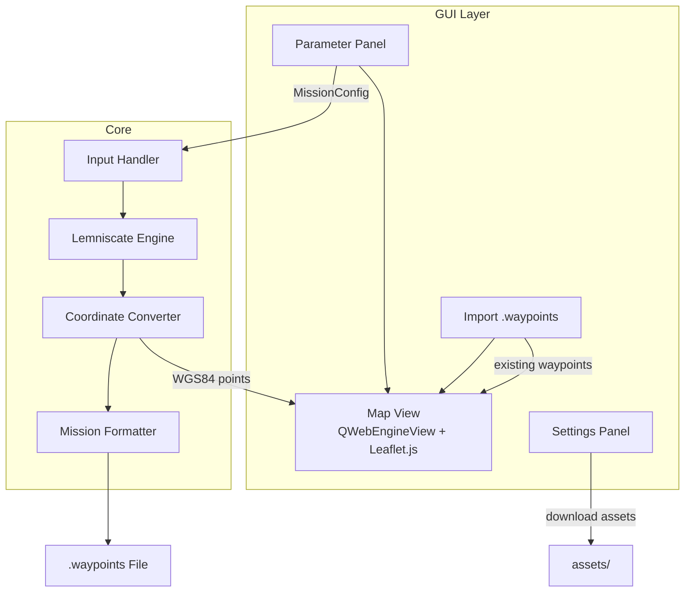
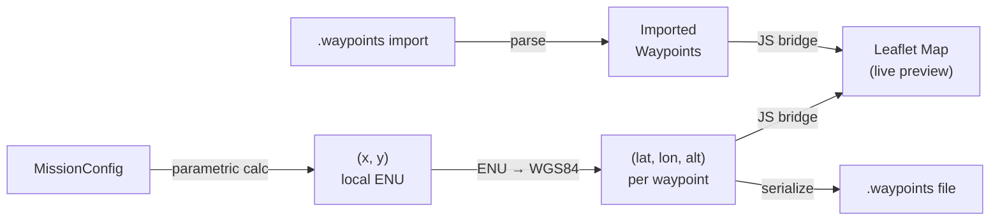

# Architecture

## Overview

LEMNISCATE takes user-supplied mission parameters, computes waypoints along a Bernoulli lemniscate, and writes a `.waypoints` file in the format expected by ArduPilot Mission Planner. A PyQt6 GUI provides an interactive interface with a live map preview powered by Leaflet.js.

## Modules

### `src/core/`

#### `models.py`
`MissionConfig` and `Waypoint` dataclasses. The shared data contract between core and GUI layers.

#### `config.py`
Manages application settings. Loads embedded defaults from `assets/default_config.json` at startup, then merges any user overrides from `config.json` placed next to the executable. Writes only the keys that differ from defaults, so `config.json` is never created unless the user changes something.

#### `input_handler.py`
Parses and validates parameters from the GUI or CLI. Returns a normalized `MissionConfig`. Rejects invalid values early (e.g. `a ≤ 0`, `n < 4`).

#### `lemniscate_engine.py`
Applies the Bernoulli lemniscate parametric equations to produce `n` evenly spaced points over `[0, 2π)`. Applies a 2D rotation matrix for the requested orientation. Output: a list of `(x, y)` coordinates in meters relative to the center.

#### `coordinate_converter.py`
Converts local ENU `(x, y)` meter offsets to WGS84 `(latitude, longitude)` using the center point as the reference origin.

#### `mission_formatter.py`
Serializes the waypoint list into the ArduPilot `.waypoints` format. Optionally prepends a TAKEOFF command and appends an RTL command. Also parses existing `.waypoints` files for import.

### `src/gui/`

#### `main_window.py`
Top-level `QMainWindow`. Owns the layout: parameter panel on the left, map view on the right. Hosts the menu bar with access to Settings.

#### `parameter_panel.py`
`QWidget` containing labeled input fields for all `MissionConfig` parameters. Emits a `config_changed` signal on every value change so the map updates in real time.

#### `map_view.py`
`QWebEngineView` wrapper. Loads `assets/map.html` which bootstraps Leaflet.js. Exposes a `QWebChannel` bridge so Python can push waypoint data to JavaScript without writing intermediate files.

#### `bridge.py`
`QObject` subclass registered on `QWebChannel`. Python-callable methods push data to the Leaflet map via `page().runJavaScript()`.

#### `waypoint_importer.py`
Thin wrapper around `mission_formatter.parse_waypoints_file`. Opens a file dialog and returns a structured waypoint list.

#### `settings_panel.py`
Allows the user to change preferences (default coordinates, tile layer, speed, waypoint count) and download Leaflet.js assets locally for offline use. Reads from and writes through `AppConfig` — only changed keys are persisted to `config.json` next to the executable.

### `assets/`

#### `map.html`
Self-contained HTML page loaded by `MapView`. Bootstraps Leaflet.js (CDN by default, local files if downloaded via Settings). Exposes `drawLemniscate()`, `drawImportedMission()`, and `panTo()` as global JS functions callable from Python via `runJavaScript()`.

#### `default_config.json`
Read-only defaults embedded into the executable by PyInstaller. Never written to at runtime. `AppConfig` falls back to these values for any key absent from the user's `config.json`.

### `main.py`
Application entry point. Launches the PyQt6 `QApplication` and `MainWindow` in GUI mode, or runs the headless CLI pipeline when `--no-gui` is passed.

---

## Data Flow

---

## Dependencies

| Package | Purpose |
|---------|---------|
| `PyQt6` | GUI framework, window management |
| `PyQt6-WebEngine` | `QWebEngineView` for Leaflet map rendering |
| `PyQt6-WebEngineWidgets` | Widget bindings for `QWebEngineView` |
| `math` | Trigonometry and coordinate conversion |
| `dataclasses` | `MissionConfig` and `Waypoint` models |
| `argparse` | Headless CLI fallback |
| `unittest` | Unit tests |

> Map tiles (OSM / ESRI satellite) are fetched via CDN at runtime. The Settings panel provides a one-click download to cache Leaflet assets locally. Defaults are embedded in the executable via `assets/default_config.json`; user overrides are persisted to `config.json` next to the exe only when something changes.
