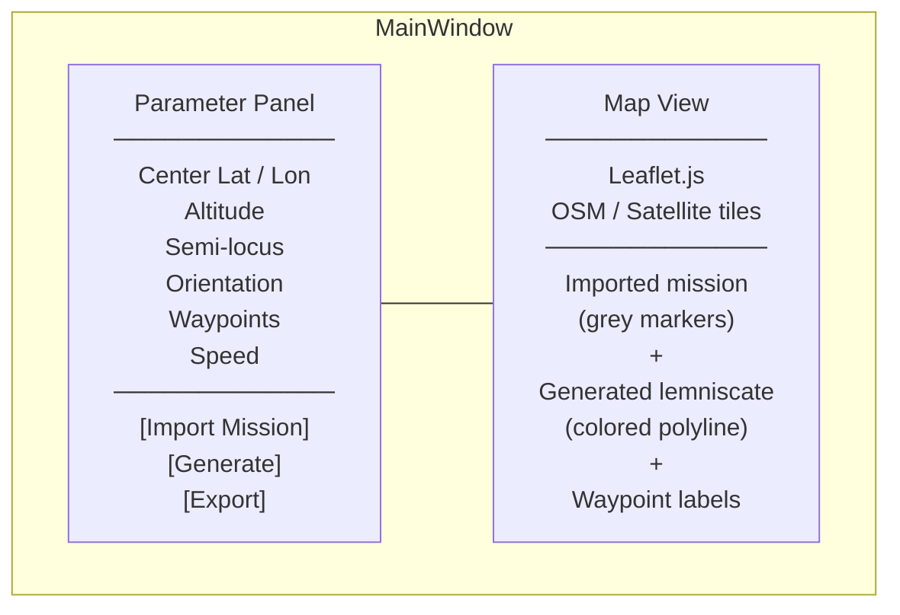
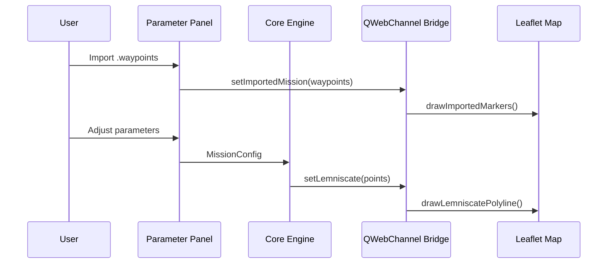

# Design

## Mathematical Background

### Bernoulli Lemniscate

The Bernoulli lemniscate is the locus of points where the product of distances to two foci is constant. Its parametric form:

```
x(t) = a · √2 · cos(t) / (sin²(t) + 1)
y(t) = a · √2 · sin(t) · cos(t) / (sin²(t) + 1)
```

where `t ∈ [0, 2π)` and `a` is the scale parameter (half the figure's widest span, in meters).

### Waypoint Sampling

`n` waypoints are placed at evenly spaced parameter values:

```
tᵢ = 2π · i / n,   i = 0, 1, …, n-1
```

Higher `n` produces a smoother path. `n = 36` (one point every 10°) is a practical default for competition use.

### Orientation

The figure is rotated by angle `θ` (clockwise from north, degrees):

```
x' =  x · cos(θ) + y · sin(θ)
y' = -x · sin(θ) + y · cos(θ)
```

### Coordinate Conversion (ENU → WGS84)

For the distances involved in competition missions, a flat-Earth approximation is sufficient:

```
Δlat = y' / R
Δlon = x' / (R · cos(lat₀))

lat = lat₀ + Δlat · (180 / π)
lon = lon₀ + Δlon · (180 / π)
```

`R = 6 371 000 m`. Precision can be improved with WGS84 ellipsoid parameters if needed.

---

## Input Parameters

| Parameter | Type | Description |
|-----------|------|-------------|
| `center_lat` | float | Lemniscate center latitude |
| `center_lon` | float | Lemniscate center longitude |
| `altitude` | float | Constant flight altitude (m, AGL) |
| `semi_locus` | float | Scale parameter `a` (m) |
| `orientation` | float | Clockwise rotation from north (°) |
| `n_waypoints` | int | Number of waypoints to generate |
| `speed` | float | Target airspeed (m/s), optional |

---

## Output Format

### ArduPilot `.waypoints`

```
QGC WPL 110
0   1  0  16  0  0  0  0  <lat>  <lon>  <alt>  1   ← Home
1   0  3  22  0  0  0  0  0      0      <alt>  1   ← TAKEOFF
2   0  3  16  0  0  0  0  <lat>  <lon>  <alt>  1   ← WP 1
…
N   0  3  16  0  0  0  0  <lat>  <lon>  <alt>  1   ← WP n
N+1 0  3  20  0  0  0  0  0      0      0      1   ← RTL
```

Column order: `index, current, frame, command, param1-4, lat, lon, alt, autocontinue`

---

## GUI Design

### Layout



The window is split into two panes: a narrow parameter panel on the left and a full-height map view on the right.

### Map View

The map is rendered inside a `QWebEngineView` using a locally bundled Leaflet.js page. Two tile layers are available and toggled via a layer control:

- **Street** — OpenStreetMap
- **Satellite** — ESRI World Imagery

A `QWebChannel` bridge connects Python to Leaflet, so waypoint updates are pushed directly as JSON without writing intermediate files.

### Importing an Existing Mission

The user can load any ArduPilot `.waypoints` file via **Import Mission**. The imported waypoints are displayed as numbered grey markers, replicating the Mission Planner map view. The generated lemniscate is then overlaid as a distinct colored polyline so the relationship between the two is immediately visible.



### Real-time Preview

Every parameter change re-runs the core engine and pushes the new polyline to the map via the bridge. No explicit "Refresh" button is needed. A debounce of ~150 ms prevents excessive recomputation while the user is typing.

---

## Design Decisions

**QWebEngineView + Leaflet over a custom canvas.**
A custom `QGraphicsView` canvas would require reimplementing tile fetching, projection math, and zoom management. Leaflet handles all of that and the result looks identical to Mission Planner's map, which is the stated goal.

**CDN by default; offline download via Settings.**
Leaflet.js and map tiles are loaded from CDN at runtime, keeping the repository and the distributed executable compact. The Settings panel provides a one-click asset download that caches Leaflet locally. `map.html` checks for local assets at load time and falls back to CDN if they are absent.

**Portable configuration: embedded defaults + exe-adjacent overrides.**
`assets/default_config.json` is bundled into the executable by PyInstaller and is read-only at runtime. On startup, `AppConfig` loads these defaults, then merges any user overrides from `config.json` placed next to the executable. If the user never changes a setting, `config.json` is never created and the exe remains a single self-contained file. When a setting changes, only the differing keys are written — the file stays minimal. Copying the exe (and optionally the `config.json` beside it) to another machine is sufficient to transfer the full installation.

**`--no-gui` CLI fallback.**
Competition ground stations may not have a display server. The core engine is fully decoupled from the GUI so `main.py --no-gui` produces a `.waypoints` file without launching Qt.

**Constant altitude.**
The lemniscate is a 2D shape. A variable-altitude extension is left for a future phase but constant altitude satisfies Teknofest criteria.

**Minimum waypoints.**
At least 8 points (every 45°) define a recognizable figure; ≥ 24 is recommended for visual quality and smooth autopilot tracking.
